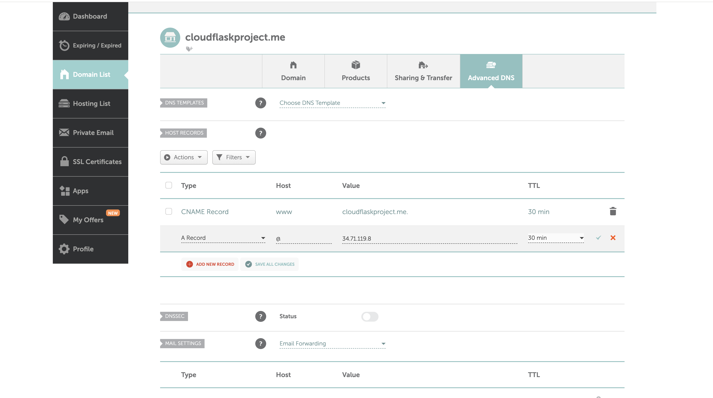
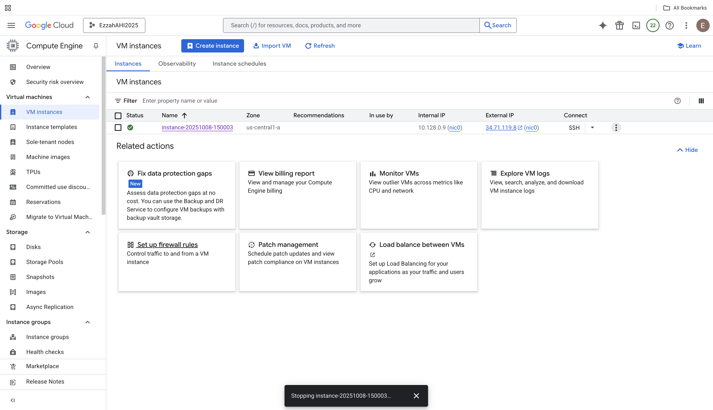

# Flask on Cloud VM (Assignment 2)

## Student Info
- Name:  Ezzah Asad
- Cloud Provider:  Google Cloud Platform (GCP)

## Video recording: 
- Zoom/Loom: Loom
https://www.loom.com/share/dd7b51a695c54a3cb11f0c12d068f591?sid=0b3a55a1-aea3-4d14-809e-314edae776fb

## Steps
### 1. VM Creation
Selected the **e2-micro machine type (2 vCPU, 1 GB memory)** and the **Ubuntu 25.04 Minimal** OS image. 

### 2. Networking (Port 5003 Open)
 Displays the **networking configuration** for the VM. Enabled **Allow HTTP traffic** and **Allow HTTPS traffic** to permit web requests to the Flask app.  **network interface section**, the primary internal IP and the external IP: **ephemeral** was set at default. 

### 3. OS Update + Python Install
OS and development tools setup process:
Updated and upgraded all Ubuntu packages.
Installed Git, Python 3.13, pip, and venv — in that order to prevent dependency errors and ensured the environment was fully configured for Flask deployment.

### 4. Flask App Running
Flask app running on port 5003 inside the SSH terminal.

### 5. Public IP Access
Confirming that the Flask app is accessible through the VM’s public IP address in a web browser.
URL: http://34.44.114.108:5003 

### 6. (Bonus) Domain Name
Custom domain was created using Namecheap through the GitHub Student Developer Pack and then linked to my Google Cloud VM by adding an A record for my external IP (34.71.119.8) as well as the CNAME for www redirection. This external IP address matches the configuration shown in the loom video. 
Domain: http://cloudflaskproject.me:5003/ 

### Summary
In this project, I successfully deployed a Flask web application on a Google Cloud Virtual Machine. The process included creating a VM instance, configuring firewall rules to open port 5003, updating the operating system, and installing Python, pip, Git, and venv in the correct order. 
I initially encountered several errors when running pip and Flask due to missing dependencies and incorrect installation order. To fix this, I recreated my machine multiple times and carefully reorganized my SSH commands. I started with system updates and then installing the required packages one by one. Once the environment was properly set up, the Flask application launched successfully and was accessible via my public IP address.
